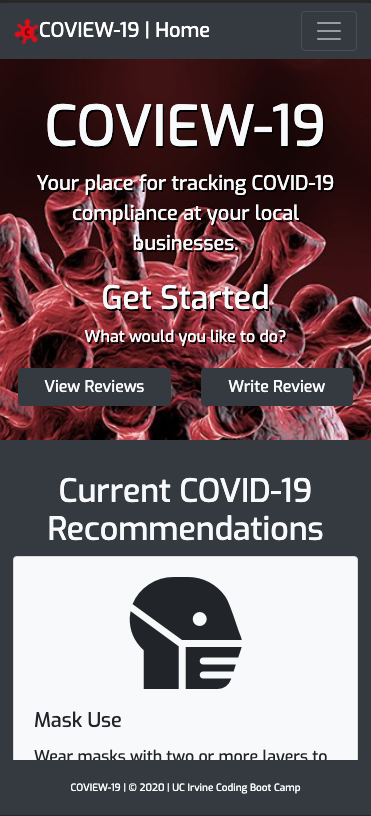
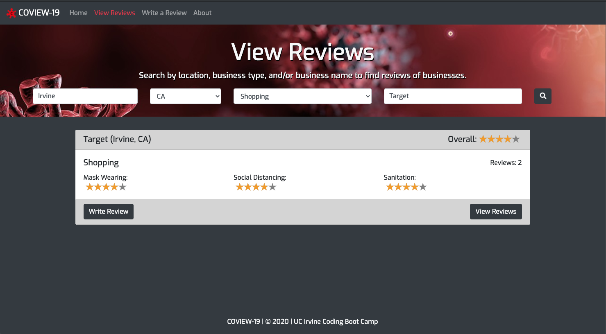
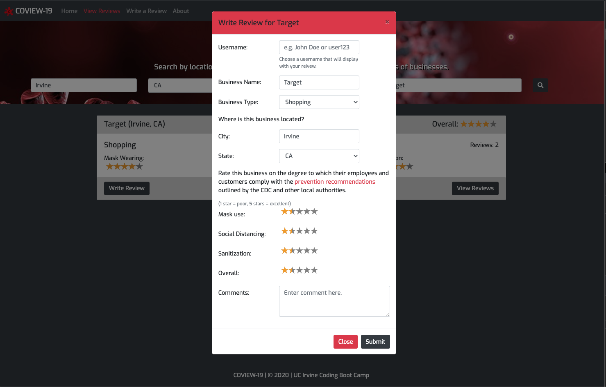
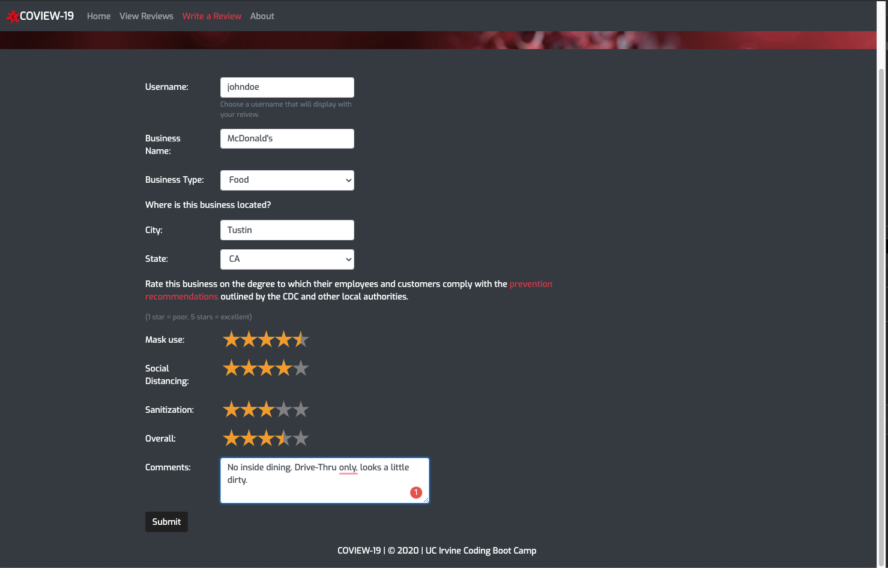
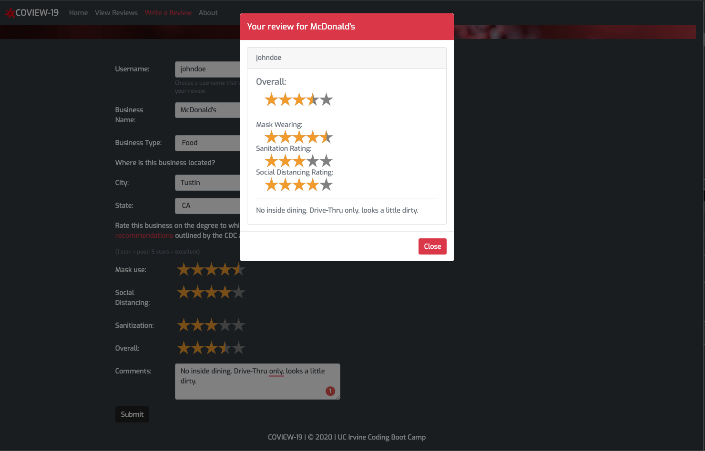
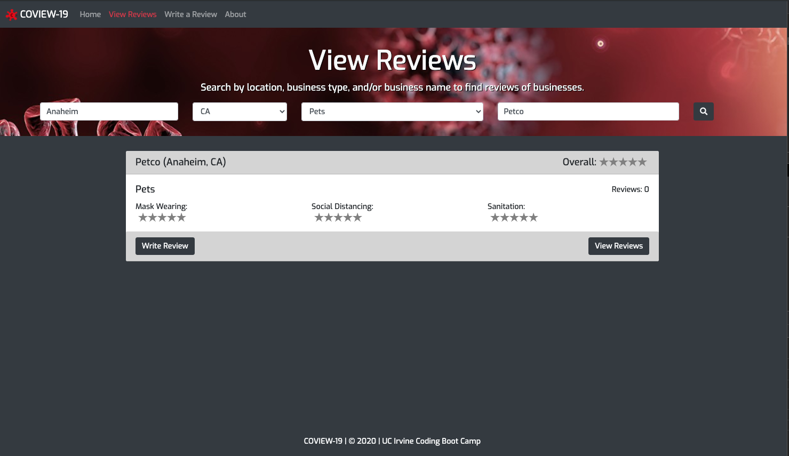
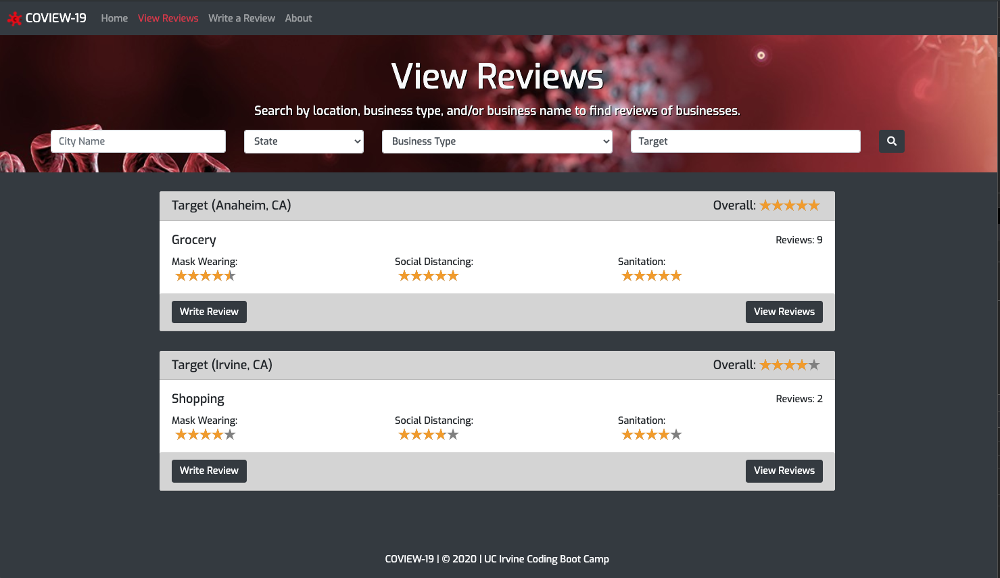
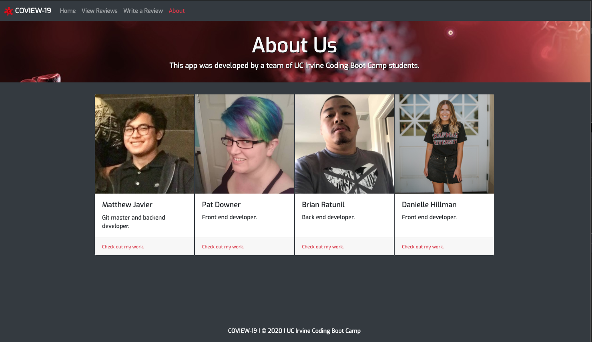

# COVIEW-19

## Collaborators

Pat Downer, Matthew Javier, Brian Ratunil, Danielle Hillman

## About

COVIEW-19 is an application that allows users to review local businesses based on COVID-19 guidelines. Users can search through city, state, business type, or/ and business name.
Reviewing a business includes rating the following: mask usage, social distancing, sanitization, overall rating and any comments specific to that business. Reviews will be connected to that businesses for all users to see.

## Images

* The initial home page of COVIEW-19 on a mobile device
  

* Finding reviews for a specific business
  

* Modal for writing a review
  

* Adding a business by writing a review for it
  

* Business without any reviews
  

* Business with multiple reviews
  

* About Us page

## Use our application

Our application is deployed through Heroku. Users do not need a login or password to begin adding reviews to businesses.
View the application here at: https://sleepy-forest-03534.herokuapp.com/

## Technologies used

* JQuery auto complete package
* RateYo package
* Moment js
* Bootstrap
* Font Awesome
* Google Fonts
* Iconpacks
* Axios
  
## Future Development

For the future, our group would love to achieve functionality for business owners to login and add their businesses for users to review. A database of users that logs all of their reviews.